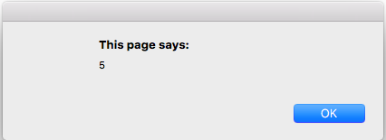
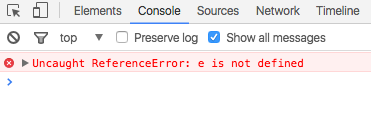

## Scope
Scope, kita sudah sangat sering jumpai jika kita telah mengenal bahasa pemrograman lain sebelumnya, seperti PHP, Python, Ruby, Java, dll.
Tapi mungkin masih banyak dari anda yang bertanya apa itu scope?
Scope adalah ruang lingkup dari kode program. Jadi ini adalah batasan - batasan pengaksesan sebuah kode program.

Scope terbagi dalam 3 bagian :

#### 1. Block Scope
Block scope adalah ruang lingkup kode program yang terbatas hanya dalam sebuah block code yang biasanya berada di dalam if statements, looping (for, while, dll), try-catch, dll. Yang ditandai dengan {} (kurung kurawal) sebagai pembuka dan penutup kode program tersebut.
Namun javascript tidak mengenal block scope, javascript hanya mengenal function scope dan global scope.

>Terkecuali untuk try-catch sejak es3 memang di rancang untuk memiliki block scope

```javascript
if(true) {
  var a = 5 // Kita menginisialisai variabel a dengan nilai 5
}

alert(a); // jika dipanggil di luar block scope if, apa yang terjadi?
```
Yang terjadi :



Inilah bukti jika block scope tidak berlaku di javascript.

Untuk try - catch :

```javascript

try {
  throw 'error';
}
catch(e) {

}

console.log(e); // jika di panggil diluar block scope try-catch, apa yang terjadi?
```

Yang terjadi :



Maka berarti, try-catch pada javascript memiliki block scope.
